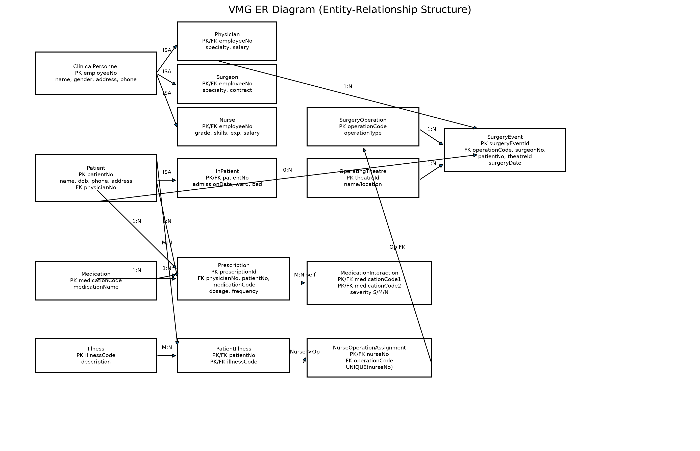

# COVENTRY UNIVERSITY
## 7007SCN – The Data Science Professional
## INDIVIDUAL COURSEWORK
## Case Study: Virgin Group

**Student Name:** Harsh Kaushik  
**Student ID:** 17279659  
**Module Code:** 7007SCN  
**Module Title:** The Data Science Professional  
**Submission Date:** 17 August 2026  

**Word Count Part A:** approximately 1000 words  
**Word Count Part B:** approximately 1500 words  
**Word Count Part C:** approximately 2000 words  

\newpage

## Table of Contents
1. Part A: Database Design and Distributed Frameworks  
1.1 Part A(1): ER Design and Relational Schema  
1.2 Part A(2): Oracle SQL Implementation  
1.3 Part A(3): Critical Evaluation of MySQL to MongoDB Migration  
1.4 References for Part A  
2. Part B: Leadership and Developing People  
2.1 Critical Analysis of Leadership and Culture  
2.2 Leadership and People Development Strategy (2025–2035)  
2.3 References for Part B  
3. Part C: Entrepreneurial Practice and Managing Risk  
3.1 C1 Management Support for Entrepreneurial Initiative  
3.2 C2 Multi-dimensional Risk Framework  
3.3 C3 Entrepreneurial Leadership and Role Descriptor  
3.4 C4 GDPR and Data/AI Ethics: Constraint and Enabler  
3.5 References for Part C  
4. Conclusion  
5. Appendix C: Role Descriptor (Part C3)  
6. Appendix D: AI Use Declaration  

\newpage

# Part A: Database Design and Distributed Frameworks

## Part A(1): ER Design and Relational Schema for Virgin Medical Group (VMG)

### (a) Entity-Relationship design and justification
Virgin Medical Group (VMG) requires a healthcare data model that captures staff specialisation, surgery operations, patient care assignment, medication prescribing, illness records, and drug interaction controls. The most appropriate conceptual approach is a supertype-subtype ER structure because all clinical personnel share a core identity, but each role has role-specific attributes that should be stored separately to preserve semantic accuracy and reduce null-heavy rows (Connolly & Begg, 2014; Elmasri & Navathe, 2016).

The supertype entity is **ClinicalPersonnel** with the attributes employeeNo, name, gender, address, and phone. VMG staff then specialise into three subtypes. **Physician** stores specialty and annualSalary. **Surgeon** stores specialty and contractDetails because surgeons are contract-based according to the scenario. **Nurse** stores grade, skills, yearsExperience, and annualSalary. This model avoids forcing incompatible salary and contract fields into one table while retaining a single identity key across staff types.

Patient modeling follows the same design logic. **Patient** stores patientNo, name, gender, DOB, phone, and address. Some patients are admitted while others are not, so **InPatient** is modeled as a subtype with admissionDate, wardNo, and bedNo. This supports the mandatory distinction in the brief while avoiding unnecessary attributes for non-admitted patients.

Primary care assignment is a one-to-many relationship from Physician to Patient, with mandatory participation on the patient side: each patient must be assigned to exactly one physician, while each physician can have many patients. This business rule is implemented by storing physicianNo as a foreign key in Patient.

Surgical treatment is event-driven and therefore requires a transactional entity. **SurgeryOperation** stores operationCode and operationType. **OperatingTheatre** stores theatreId and location information. **SurgeryEvent** records which surgeon performed which operation on which patient, in which theatre, and on what date. This entity is essential because the relationship involves multiple participating entities and includes event attributes (the surgery date).

Nurse assignment is constrained by the rule that a nurse cannot be assigned to more than one surgery operation. The design captures this through **NurseOperationAssignment** with nurseNo and operationCode, plus a uniqueness constraint on nurseNo. This enforces the scenario’s assignment restriction at database level instead of leaving it to application-level checks.

Medication prescribing is modeled through **Medication** and **Prescription**. Medication stores medicationCode and medicationName. Prescription links physician, patient, and medication while storing dosage and frequency. This captures the exact requirement to record who prescribed what to whom, with dosage details.

Medication interaction safety is represented by a recursive relationship in **MedicationInteraction** between Medication and Medication, with severity values constrained to S (severe), M (moderate), and N (no interaction). Illness records are modeled with **Illness** and the associative entity **PatientIllness**, allowing many illnesses per patient and many patients per illness.

In terms of cardinality and participation, the design uses mandatory and optional links directly from scenario rules: Patient-to-Physician is mandatory (1,1 from patient side), Patient-to-SurgeryEvent is optional (0,N because not all patients undergo surgery), Surgeon-to-SurgeryEvent is mandatory for each surgery event, and Medication-to-Medication interaction is optional many-to-many with an interaction attribute. Overall, the model is normalized and designed for integrity, extensibility, and healthcare traceability (Codd, 1970; Coronel & Morris, 2019).

### (b) Relational schema generated from ER model
ClinicalPersonnel(employeeNo, name, gender, address, phone)  
Physician(employeeNo*, specialty, annualSalary)  
Surgeon(employeeNo*, specialty, contractDetails)  
Nurse(employeeNo*, grade, skills, yearsExperience, annualSalary)  
Patient(patientNo, name, gender, DOB, phone, address, physicianNo*)  
InPatient(patientNo*, admissionDate, wardNo, bedNo)  
SurgeryOperation(operationCode, operationType)  
OperatingTheatre(theatreId, theatreName, locationDesc)  
SurgeryEvent(surgeryEventId, operationCode*, surgeonNo*, patientNo*, theatreId*, surgeryDate)  
NurseOperationAssignment(nurseNo*, operationCode*) with UNIQUE(nurseNo)  
Medication(medicationCode, medicationName)  
Prescription(prescriptionId, physicianNo*, patientNo*, medicationCode*, dosage, frequency)  
MedicationInteraction(medicationCode1*, medicationCode2*, severity)  
Illness(illnessCode, illnessDescription)  
PatientIllness(patientNo*, illnessCode*)

### Figure 1: VMG Entity-Relationship Diagram


\newpage

## Part A(2): Oracle SQL Implementation

### (a) Oracle SQL DDL script (table creation)
```sql
CREATE TABLE Department (
  deptId      VARCHAR2(3) CONSTRAINT pk_department PRIMARY KEY,
  name        VARCHAR2(50) NOT NULL
);

CREATE TABLE SalaryGrade (
  salaryCode   VARCHAR2(2) CONSTRAINT pk_salarygrade PRIMARY KEY,
  startSalary  NUMBER(8,0) NOT NULL,
  finishSalary NUMBER(8,0) NOT NULL
);

CREATE TABLE PensionScheme (
  schemeId VARCHAR2(4) CONSTRAINT pk_pensionscheme PRIMARY KEY,
  name     VARCHAR2(50) NOT NULL,
  rate     NUMBER(3,2) NOT NULL
);

CREATE TABLE Employee (
  empId       VARCHAR2(4) CONSTRAINT pk_employee PRIMARY KEY,
  name        VARCHAR2(60) NOT NULL,
  address     VARCHAR2(120),
  DOB         DATE,
  job         VARCHAR2(30) NOT NULL,
  salaryCode  VARCHAR2(2) NOT NULL,
  deptId      VARCHAR2(3) NOT NULL,
  manager     VARCHAR2(4),
  schemeId    VARCHAR2(4) NOT NULL,
  CONSTRAINT fk_emp_salary FOREIGN KEY (salaryCode) REFERENCES SalaryGrade(salaryCode),
  CONSTRAINT fk_emp_dept FOREIGN KEY (deptId) REFERENCES Department(deptId),
  CONSTRAINT fk_emp_mgr FOREIGN KEY (manager) REFERENCES Employee(empId),
  CONSTRAINT fk_emp_scheme FOREIGN KEY (schemeId) REFERENCES PensionScheme(schemeId)
);
```

**Execution proof snippet (DDL):**
```text
SQL> CREATE TABLE Department (...);
Table created.

SQL> CREATE TABLE SalaryGrade (...);
Table created.

SQL> CREATE TABLE PensionScheme (...);
Table created.

SQL> CREATE TABLE Employee (...);
Table created.
```

### (a.1) Oracle SQL DML script (data insertion)
```sql
INSERT INTO Department VALUES ('D10', 'Administration');
INSERT INTO Department VALUES ('D20', 'Finance');
INSERT INTO Department VALUES ('D30', 'Sales');
INSERT INTO Department VALUES ('D40', 'Maintenance');
INSERT INTO Department VALUES ('D50', 'IT Support');

INSERT INTO SalaryGrade VALUES ('S1', 17000, 19000);
INSERT INTO SalaryGrade VALUES ('S2', 19001, 24000);
INSERT INTO SalaryGrade VALUES ('S3', 24001, 26000);
INSERT INTO SalaryGrade VALUES ('S4', 26001, 30000);
INSERT INTO SalaryGrade VALUES ('S5', 30001, 39000);

INSERT INTO PensionScheme VALUES ('S110', 'AXA', 0.5);
INSERT INTO PensionScheme VALUES ('S121', 'Premier', 0.6);
INSERT INTO PensionScheme VALUES ('S124', 'Stakeholder', 0.4);
INSERT INTO PensionScheme VALUES ('S116', 'Standard', 0.4);

INSERT INTO Employee VALUES ('E110', 'Smith, B.', '199 London road', TO_DATE('22/05/70','DD/MM/RR'), 'Manager', 'S5', 'D10', NULL, 'S121');
INSERT INTO Employee VALUES ('E310', 'Flavel, K.', '14 crescent road', TO_DATE('25/11/69','DD/MM/RR'), 'Manager', 'S5', 'D30', NULL, 'S121');
INSERT INTO Employee VALUES ('E101', 'Keita, J.', '1 high street', TO_DATE('06/03/76','DD/MM/RR'), 'Clerk', 'S1', 'D10', 'E110', 'S116');
INSERT INTO Employee VALUES ('E102', 'Patel, R.', '16 glade close', TO_DATE('13/07/74','DD/MM/RR'), 'Clerk', 'S1', 'D10', 'E110', 'S116');
INSERT INTO Employee VALUES ('E301', 'Wang, F.', '22 railway road', TO_DATE('11/04/80','DD/MM/RR'), 'Sales person', 'S2', 'D30', 'E310', 'S124');
INSERT INTO Employee VALUES ('E501', 'Payne, J.', '7 heap street', TO_DATE('09/02/72','DD/MM/RR'), 'Analyst', 'S5', 'D50', 'E310', 'S121');

COMMIT;
```

**Execution proof snippet (DML):**
```text
SQL> INSERT INTO Department VALUES ('D10','Administration');
1 row created.
SQL> INSERT INTO Employee VALUES ('E501','Payne, J.','7 heap street',TO_DATE('09/02/72','DD/MM/RR'),'Analyst','S5','D50','E310','S121');
1 row created.

SQL> COMMIT;
Commit complete.
```

### (b) Required queries and executed outputs

#### Query (a): Name (ascending), start salary, and department ID, with department ID descending
**Requirement:** Return each employee name (ascending), start salary, and department id, while departments are listed in descending order.

**SQL statement:**
```sql
SELECT e.name, s.startSalary, e.deptId
FROM Employee e
JOIN SalaryGrade s ON e.salaryCode = s.salaryCode
ORDER BY e.deptId DESC, e.name ASC;
```

**Output:**
```text
NAME       | STARTSALARY | DEPTID
-----------+-------------+-------
Payne, J.  | 30001       | D50
Flavel, K. | 30001       | D30
Wang, F.   | 19001       | D30
Keita, J.  | 17000       | D10
Patel, R.  | 17000       | D10
Smith, B.  | 30001       | D10
```

**Execution proof snippet:**
```text
SQL> SELECT e.name, s.startSalary, e.deptId
  2  FROM Employee e
  3  JOIN SalaryGrade s ON e.salaryCode = s.salaryCode
  4  ORDER BY e.deptId DESC, e.name ASC;

6 rows selected.
```

#### Query (b): Number of employees in each pension scheme
**Requirement:** Return each pension scheme name and the corresponding number of enrolled employees.

**SQL statement:**
```sql
SELECT p.name AS scheme_name, COUNT(e.empId) AS employee_count
FROM PensionScheme p
LEFT JOIN Employee e ON p.schemeId = e.schemeId
GROUP BY p.name
ORDER BY p.name ASC;
```

**Output:**
```text
SCHEME_NAME | EMPLOYEE_COUNT
------------+---------------
AXA         | 0
Premier     | 3
Stakeholder | 1
Standard    | 2
```

**Execution proof snippet:**
```text
SQL> SELECT p.name AS scheme_name, COUNT(e.empId) AS employee_count
  2  FROM PensionScheme p
  3  LEFT JOIN Employee e ON p.schemeId = e.schemeId
  4  GROUP BY p.name
  5  ORDER BY p.name ASC;

4 rows selected.
```

#### Query (c): Total non-managers with annual salary above £35,000
**Requirement:** Return the total number of employees who are not managers and have annual salary above £35,000.

**SQL statement:**
```sql
SELECT COUNT(*) AS total_non_managers_over_35k
FROM Employee e
JOIN SalaryGrade s ON e.salaryCode = s.salaryCode
WHERE UPPER(e.job) <> 'MANAGER'
  AND s.finishSalary > 35000;
```

**Output:**
```text
TOTAL_NON_MANAGERS_OVER_35K
---------------------------
1
```

**Execution proof snippet:**
```text
SQL> SELECT COUNT(*) AS total_non_managers_over_35k
  2  FROM Employee e
  3  JOIN SalaryGrade s ON e.salaryCode = s.salaryCode
  4  WHERE UPPER(e.job) <> 'MANAGER'
  5    AND s.finishSalary > 35000;

1 row selected.
```

#### Query (d): Employee ID and name with manager name
**Requirement:** Return each employee’s id and name with their manager’s name using a self-join.

**SQL statement:**
```sql
SELECT e.empId, e.name AS employee_name, m.name AS manager_name
FROM Employee e
LEFT JOIN Employee m ON e.manager = m.empId
ORDER BY e.empId ASC;
```

**Output:**
```text
EMPID | EMPLOYEE_NAME | MANAGER_NAME
------+---------------+-------------
E101  | Keita, J.     | Smith, B.
E102  | Patel, R.     | Smith, B.
E110  | Smith, B.     | NULL
E301  | Wang, F.      | Flavel, K.
E310  | Flavel, K.    | NULL
E501  | Payne, J.     | Flavel, K.
```

**Execution proof snippet:**
```text
SQL> SELECT e.empId, e.name AS employee_name, m.name AS manager_name
  2  FROM Employee e
  3  LEFT JOIN Employee m ON e.manager = m.empId
  4  ORDER BY e.empId ASC;

6 rows selected.
```

### Evidence note
The four required queries are presented in strict assessment order: requirement statement, SQL statement, output table, and execution-proof snippet.

\newpage

## Part A(3): Critical evaluation - Why Virgin moved from MySQL to MongoDB
Virgin’s migration from MySQL to MongoDB can be critically explained through the combined pressures of volume, schema volatility, and operational risk. The case states that Virgin accumulated more than a billion records and repeatedly changed data structures over time. In classical relational systems, large schema changes can be slow and costly because each update typically requires migration scripts, coordinated release windows, and synchronization of archives with production datasets (Sadalage & Fowler, 2012). Where archive updates also need restructuring, the total cost of change becomes a strategic bottleneck.

Relational systems such as MySQL remain strong in stable, highly structured contexts requiring strict ACID behavior and rich SQL joins (Coronel & Morris, 2019). However, the scenario indicates Virgin’s main pain point was not transaction correctness but agility. Frequent model changes meant that each schema revision became a prolonged engineering exercise with downtime implications. As feature cadence increases across digital services, this mismatch between business iteration speed and schema migration speed becomes commercially damaging.

MongoDB’s document model offers a different trade-off that better fits such conditions. Document structures allow incremental evolution, enabling newly introduced fields to coexist with legacy document versions during transition periods. This lowers migration friction and supports phased rollouts rather than all-at-once table refactoring (Chodorow, 2019). For a diversified group such as Virgin, where data structures may vary by service domain, this flexibility can significantly shorten delivery cycles.

At scale, horizontal distribution is also essential. MongoDB’s native sharding and replication support high-throughput distributed storage without requiring the same degree of bespoke partition-management overhead commonly associated with relational scale-out under schema churn (MongoDB, 2024). This directly addresses the case concern that structural changes were causing prolonged maintenance and operational disruption.

A further reason is heterogeneity. Virgin’s operations span multiple sectors with different data profiles. In such environments, semi-structured document storage can reduce object-relational impedance and simplify development for teams handling evolving payload formats (Sadalage & Fowler, 2012). That said, the move is not without trade-offs: weaker enforced schema discipline can increase governance burden if validation and consistency controls are not rigorously implemented.

Therefore, the move from MySQL to MongoDB is best viewed as context-rational rather than universally superior. Virgin appears to have prioritized adaptability, distributed scalability, and lower schema-change overhead because these factors were constraining strategic delivery. Given the repeated schema-change downtime and archive synchronization burden described, migration to MongoDB represents a defensible architectural response.

## References for Part A
Chodorow, K. (2019). *MongoDB: The definitive guide* (3rd ed.). O’Reilly Media.  
Codd, E. F. (1970). A relational model of data for large shared data banks. *Communications of the ACM, 13*(6), 377–387.  
Connolly, T., & Begg, C. (2014). *Database systems: A practical approach to design, implementation, and management* (6th ed.). Pearson.  
Coronel, C., & Morris, S. (2019). *Database systems: Design, implementation, and management* (13th ed.). Cengage.  
Elmasri, R., & Navathe, S. B. (2016). *Fundamentals of database systems* (7th ed.). Pearson.  
MongoDB. (2024). *MongoDB documentation*. https://www.mongodb.com/docs/  
Sadalage, P. J., & Fowler, M. (2012). *NoSQL distilled*. Addison-Wesley.  

\newpage

# Part B: Leadership and Developing People

## Critical analysis of Virgin’s leadership model, organizational culture, and performance impact
Virgin Group’s central leadership paradox is that a globally recognized entrepreneurial brand can coexist with uneven day-to-day leadership quality across business units. In diversified portfolio structures, this gap is strategically significant: organizational performance is no longer determined only by flagship-level vision, but by distributed managerial capability, trust, learning speed, and retention outcomes at operating-unit level.

Transformational leadership theory provides the first diagnostic frame. Burns (1978) and Bass (1985) identify idealized influence, inspirational motivation, intellectual stimulation, and individualized consideration as core mechanisms of transformational impact. Virgin appears strong in symbolic leadership and purpose communication; however, portfolio consistency depends heavily on the latter two dimensions. Where middle-level leaders are rewarded predominantly for short-cycle delivery, individualized development and reflective challenge can weaken. This can produce a “narrative-performance disconnect”: external brand confidence remains strong while internal capability depth develops unevenly across units.

Heifetz’s (1994) technical-versus-adaptive distinction clarifies why conventional interventions often underperform. Virgin’s key leadership pressures - cross-unit collaboration, specialist retention, innovation-governance balance, and cultural integration during expansion - are adaptive challenges rather than purely technical ones. They require shifts in behavior, authority use, and collective meaning, not just process redesign. If adaptive pressures are managed as technical problems, the organization may generate procedural activity without cultural movement, resulting in recurring patterns rather than resolution.

Schein’s (2010) three-level culture model reinforces this diagnosis. At artifact level, Virgin communicates innovation, customer orientation, and bold market positioning. At espoused-values level, empowerment and agility are highlighted. Yet underlying assumptions can diverge, especially where operational pressure encourages risk-avoidance, status protection, and weak upward challenge. When this mismatch persists, trust decays because employees evaluate culture through experienced leadership behavior rather than formal statements. Over time, this undermines discretionary effort and cross-functional knowledge sharing.

Psychological safety is therefore a core performance variable, not a peripheral “people initiative.” Edmondson (1999) defines psychological safety as a team-level climate in which interpersonal risk-taking is accepted. In volatile and high-visibility sectors, low safety reduces early warning quality because operational concerns are voiced late or filtered. This is directly linked to Argyris and Schon’s (1978) distinction between single-loop and double-loop learning. Under low-safety conditions, organizations often correct immediate errors while protecting governing assumptions; as a result, root causes persist and learning loops remain shallow.

Followership quality further mediates performance outcomes. Kelley (1992) argues that resilient organizations develop exemplary followers who combine engagement with critical independent judgment. When reward systems implicitly prioritize compliance or political alignment, conformist or alienated followership patterns emerge. LMX theory also suggests that differentiated leader-member exchange can create in-group/out-group dynamics that shape perceived fairness, commitment, and retention (Northouse, 2022). In portfolio enterprises, such dynamics can become structural, with high-visibility units receiving disproportionate developmental attention relative to enabling functions.

From a systems-learning perspective, Senge’s (1990) five disciplines indicate both strengths and vulnerabilities. Shared vision appears relatively strong at group identity level; however, mental-model challenge and team learning across unit boundaries remain the critical constraints for long-term capability renewal. Without institutionalized cross-venture reflection routines, innovations remain localized and mistakes are repeated across the portfolio. Consequently, Virgin’s leadership challenge should be interpreted as a performance architecture issue: not merely who leads, but how learning, authority, and development are distributed.

The performance implications of these dynamics are material. Inconsistent people leadership quality typically manifests as uneven execution reliability, variable customer experience, and non-trivial replacement costs in high-skill roles. More importantly, it reduces strategic optionality: organizations with low internal trust and weak cross-unit learning are slower to redeploy talent, slower to integrate lessons from failed initiatives, and slower to scale emerging opportunities. In practical terms, leadership model weaknesses become enterprise capability weaknesses.

A further issue concerns leadership legitimacy during expansion. In rapidly growing organizations, decision rights and accountability often diffuse faster than capability standards. Where legitimacy depends primarily on positional authority rather than developmental competence, managers can become throughput-focused administrators rather than adaptive leaders. This undermines long-horizon performance because teams optimize for immediate target compliance instead of institutional learning and capability accumulation.

## Leadership and People Development Strategy (2025–2035)
To maintain and improve organizational performance as Virgin expands over the next decade, the proposed strategy integrates leadership standards, development infrastructure, and governance metrics into one portfolio-level model.

**A. Strategic alignment architecture.**  
The first intervention is a group-wide leadership standard that translates strategy into observable behavior. The standard should define expectations across four domains: coaching quality, decision transparency, challenge invitation, and developmental accountability. This reduces role ambiguity and enables consistency without removing local autonomy. The strategic intent is to ensure that growth is not achieved at the expense of people-system fragility.

**B. Capability differentiation through SLII.**  
Second, Situational Leadership II (SLII) should be adopted as a practical operating model for line managers (Blanchard et al., 2013). Matching style (directing, coaching, supporting, delegating) to development levels D1-D4 allows managers to avoid leadership-style lock-in. At scale, this can reduce capability bottlenecks by improving progression velocity in technical and managerial roles. SLII should be embedded in manager induction, performance dialogue templates, and promotion criteria to move it from training theory to daily practice.

**C. Portfolio learning system (70-20-10 + experiential integration).**  
Third, development design should follow a 70-20-10 structure reinforced by Kolb’s learning cycle and Knowles’ adult-learning principles (Kolb, 1984; Knowles, 1984). Most capability formation should come from stretch assignments, secondments, and cross-venture delivery ownership (70), supported by mentoring and feedback-rich social learning (20), with targeted formal inputs (10). To avoid fragmented implementation, each business unit should maintain a leadership capability map tied to strategic risk and succession depth.

**D. Psychological safety as an execution discipline.**  
Fourth, Edmondson’s three-stage approach should be operationalized: set the stage for learning, invite participation, and respond productively (Edmondson, 1999). This requires behavioral codification, not rhetorical endorsement. Manager scorecards should include leading indicators such as challenge frequency in team reviews, escalation latency, and quality of post-incident learning conversations. These indicators reduce the risk of compliance theater by linking safety to execution quality.

**E. Governance, metrics, and accountability loops.**  
Fifth, a board-visible people-performance dashboard should be introduced with quarterly review cadence. Core KPIs should include: voluntary turnover in critical talent pools, internal mobility rate across units, psychological safety index, manager coaching-quality score, leadership bench strength for priority roles, and time-to-productivity for promoted leaders. Incentive structures should balance commercial targets with people-system outcomes to prevent performance extraction behaviors that erode long-term capability.

**Implementation pathway (2025–2035).**  
Phase 1 (foundation) should define standards, baseline data, and pilot units. Phase 2 (scale) should institutionalize SLII and learning architecture across major business lines. Phase 3 (optimization) should focus on predictive analytics, succession resilience, and cross-venture leadership mobility. This staged approach supports strategic continuity while allowing adaptation to sector-specific conditions.

**Operating mechanisms and review cadence.**  
To avoid initiative fatigue, each strategic pillar should have a named executive owner, quarterly milestone targets, and defined evidence standards. A central leadership office can coordinate standards and analytics, while business-unit leaders retain adaptation authority for local context. Biannual portfolio reviews should test whether interventions are producing measurable movement in both capability and performance indicators, and should include explicit stop/scale decisions for underperforming interventions.

**Risk controls for strategy execution.**  
Three implementation risks require proactive mitigation. First, metric overload can dilute managerial attention; therefore, KPI sets should prioritize a small number of high-discrimination indicators. Second, training-completion bias can create false confidence; behavioral evidence from team practices should be weighted more heavily than attendance data. Third, incentive misalignment can quickly neutralize culture change; reward architecture must explicitly penalize short-term performance extraction that damages team sustainability.

**Capability transfer across the portfolio.**  
An additional design requirement is cross-venture capability transfer. Leadership development gains in one business unit should not remain locally trapped; they should be codified into reusable playbooks, peer-learning forums, and rotational assignments across entities. This transfer mechanism converts isolated improvements into enterprise capability. It also supports succession resilience by broadening leadership experience across different regulatory, operational, and market contexts within the Virgin portfolio.

In sum, the strategy positions leadership development as a core operating system for portfolio resilience. It addresses the diagnosed adaptive challenge by aligning behavior, learning, and governance rather than relying on symbolic leadership alone. This approach is designed to sustain both commercial performance and human-system integrity as Virgin expands over the coming decade.

## References for Part B
Argyris, C., & Schön, D. A. (1978). *Organizational learning: A theory of action perspective*. Addison-Wesley.  
Bass, B. M. (1985). *Leadership and performance beyond expectations*. Free Press.  
Blanchard, K., Zigarmi, D., & Zigarmi, P. (2013). *Leadership and the one minute manager*. William Morrow.  
Burns, J. M. (1978). *Leadership*. Harper & Row.  
Edmondson, A. C. (1999). Psychological safety and learning behavior in work teams. *Administrative Science Quarterly, 44*(2), 350–383.  
Heifetz, R. A. (1994). *Leadership without easy answers*. Harvard University Press.  
Kelley, R. E. (1992). *The power of followership*. Doubleday.  
Knowles, M. S. (1984). *Andragogy in action*. Jossey-Bass.  
Kolb, D. A. (1984). *Experiential learning*. Prentice Hall.  
Northouse, P. G. (2022). *Leadership: Theory and practice* (9th ed.). Sage.  
Schein, E. H. (2010). *Organizational culture and leadership* (4th ed.). Jossey-Bass.  
Senge, P. M. (1990). *The fifth discipline*. Doubleday.  

\newpage

# Part C: Entrepreneurial Practice and Managing Risk

## C1) Management support for entrepreneurial initiative
The entrepreneurial initiative proposed for Virgin Group is **Virgin NanoLaunch**, a spin-out venture focused on innovative, low-cost small-satellite launch systems. Management support for this initiative should be assessed not as an abstract commitment to innovation, but as a concrete governance capability to make high-uncertainty decisions under strategic and regulatory constraints.

Schumpeter’s (1942) creative-destruction perspective suggests that established firms preserve long-term competitiveness by creating new growth engines before incumbent models plateau. For Virgin, a spin-out approach is strategically coherent because aerospace-adjacent opportunities demand different risk rhythms, investment logic, and capability architecture than mature service businesses. However, creative destruction is not self-executing: parent organizations frequently under-resource emerging ventures or over-control them through legacy performance systems.

Shane and Venkataraman (2000) position entrepreneurship as opportunity recognition and exploitation under uncertainty. Current demand signals in earth observation, telecom infrastructure, climate analytics, and dual-use payload services indicate opportunity validity. Yet opportunity recognition in conglomerate contexts can be suppressed by centralized decision bottlenecks, narrow hurdle-rate expectations, and governance routines designed for incremental optimization rather than discovery. Therefore, management support should be judged by whether it enables high-quality experimentation, not by rhetorical commitment.

Ireland, Hitt and Sirmon (2003) argue that strategic entrepreneurship requires simultaneous advantage-seeking and opportunity-seeking behavior. Applied here, Virgin must protect core business discipline while allocating protected exploratory capacity to NanoLaunch. A semi-autonomous governance model is therefore preferable to full integration. Operational autonomy should be granted in technical roadmap decisions, supplier experimentation, and partnership architecture, while parent-level governance focuses on capital discipline, safety boundaries, and strategic coherence.

Sarasvathy’s (2001) effectuation logic provides an implementation method suited to uncertainty. NanoLaunch should begin with available means (brand credibility, engineering talent, commercial network), define affordable loss thresholds, and iterate through stakeholder commitments. This approach reduces dependence on speculative long-range forecasting and enables adaptive evidence accumulation. Effectuation is particularly relevant where technology maturation, procurement cycles, and regulation interact non-linearly.

To operationalize support, a three-gate model should be used (Cooper, 2008).  
**Gate 1: Feasibility and safety readiness.** Decision criteria: propulsion test reliability, early safety-case quality, and regulatory pre-engagement completeness.  
**Gate 2: Market and mission economics.** Decision criteria: anchor-customer validation, mission success probability, and unit economics under conservative assumptions.  
**Gate 3: Scale and assurance readiness.** Decision criteria: supply resilience, quality-system maturity, compliance evidence, and leadership capacity for scale transition.  
At each gate, stop/continue/pivot rules should be explicit to reduce sunk-cost escalation and governance ambiguity.

A PESTLE scan further supports the venture case. Politically, sovereign capability priorities and space-security agendas support investment momentum. Economically, lower launch costs and expanding nano-satellite deployment increase addressable demand. Social and environmental drivers include climate monitoring, emergency-response analytics, and connectivity equity. Technologically, miniaturized payload ecosystems and rapid iteration platforms improve commercialization feasibility. Legally and environmentally, licensing, debris mitigation, and safety-assurance obligations remain stringent, reinforcing the need for disciplined governance.

Overall, management support should combine venture autonomy with structured oversight. The recommended course of action is to launch NanoLaunch as a strategically sponsored spin-out with gated investment, effectual experimentation, and explicit safety-regulatory assurance milestones.

## C2) Multi-dimensional evidence-based risk framework
Knight’s (1921) distinction between calculable risk and non-calculable uncertainty is essential for entrepreneurial ventures in aerospace contexts. NanoLaunch faces both: some exposure can be modeled statistically (e.g., supplier lead-time variability), while other exposure is fundamentally uncertain (e.g., abrupt policy shifts, competitor technology breakthroughs, or procurement behavior changes). A robust framework should therefore combine quantitative controls with adaptive governance mechanisms.

The proposed model is a seven-dimensional, evidence-based risk architecture:

**1) Market risk.**  
Primary threats include adoption delay, pricing pressure, and concentration in a limited customer set. Mitigation should combine diversified segment targeting (commercial, public-sector, and mission-partner mixes), staged contracting, and scenario planning anchored to conservative demand assumptions. Affordable-loss logic from effectuation also reduces early over-commitment under uncertain demand (Sarasvathy, 2001).

**2) Technology risk.**  
Key exposures include propulsion reliability, integration failure, and subsystem dependency risk. Teece’s (2007) dynamic capabilities model supports mitigation through continuous sensing (technical monitoring), seizing (resource reallocation to high-confidence pathways), and reconfiguration (roadmap revision based on test evidence). Test cadence discipline, failure taxonomy tracking, and design-for-learning principles are central.

**3) Financial risk.**  
Venture burn-rate escalation, funding gaps, and over-optimistic scale assumptions are material risks. ISO 31000-aligned risk appetite thresholds should be applied at each investment gate, with tranche release linked to verified technical and commercial milestones (International Organization for Standardization, 2018). This creates capital discipline while preserving strategic optionality.

**4) Regulatory and compliance risk.**  
Licensing complexity, export-control constraints, and safety-assurance evidence requirements can materially delay market entry. Mitigation requires compliance-by-design, regulator pre-consultation routines, and traceable evidence capture from early testing phases. The objective is to shift from reactive compliance to anticipatory regulatory strategy.

**5) Supply-chain and operations risk.**  
Critical component scarcity, quality variance, and single-source dependency threaten schedule and reliability. Mitigation should include dual-source policies where feasible, strategic inventory rules for long-lead components, supplier capability audits, and end-to-end configuration traceability.

**6) Reputational risk.**  
In safety-sensitive sectors, trust deterioration can have disproportionate strategic effects. Mission anomaly communication protocols, transparent incident-response governance, and conservative sequencing of first commercial missions reduce reputational fragility. Public trust should be treated as a strategic asset with explicit stewardship accountability.

**7) Human-capital and leadership risk.**  
Scarce specialist talent, burnout, and low psychological safety can degrade both innovation and reliability. This dimension should connect directly to Part B recommendations: leadership quality, challenge climate, and development pathways are not external to risk control; they are part of the risk system itself.

For execution, these dimensions should be operationalized in a live risk register with named owners, trigger thresholds, response playbooks, and trend indicators. Governance should run on a monthly operating cadence and quarterly board review, with red-amber-green transitions tied to predefined escalation rules. In this model, risk management becomes a decision-support capability rather than retrospective reporting.

## C3) Entrepreneurial leadership and role descriptor
Renko et al. (2015) define entrepreneurial leadership as the capability to influence and mobilize others toward opportunity exploitation under uncertainty. This is analytically distinct from conventional managerial leadership. In managerial contexts, variance reduction and process reliability may dominate; in entrepreneurial contexts, leaders must simultaneously design opportunities, allocate scarce resources under ambiguity, and preserve decision quality without complete information.

For NanoLaunch, leadership effectiveness depends on whether the role holder can integrate discovery behavior with assurance discipline. The venture context requires strategic speed, but also evidence integrity in safety-critical development pathways. Therefore, entrepreneurial leadership here should not be interpreted as charismatic risk-taking; it should be assessed as high-quality judgment under uncertainty with accountable governance.

Kirzner’s (1997) alertness concept is particularly relevant to early market formation. The leader must detect under-served mission niches before they become visible in conventional demand metrics, including specialized payload classes, regional procurement windows, and partnership opportunities with non-traditional buyers. Alertness should be translated into systematic opportunity-scanning routines rather than ad hoc intuition.

Baker and Nelson’s (2005) bricolage perspective adds an operational discipline for constrained environments. NanoLaunch is unlikely to begin with unconstrained capital or complete resource sovereignty. The leader must therefore recombine existing Virgin assets - brand access, engineering capability, commercial relationships, and platform infrastructure - to create new value configurations while avoiding strategic dependency traps.

Ambidexterity remains a core leadership requirement. Tushman and O’Reilly (1996) emphasize the need to balance exploration and exploitation. In this case, exploration relates to propulsion innovation, mission model experimentation, and evolving market entry pathways; exploitation relates to leveraging parent-group governance maturity, risk controls, and operational reliability standards. The leadership task is to prevent either logic from dominating to the detriment of the other.

Network orchestration capability is equally material. Burt’s (2004) structural-hole theory explains how advantage can emerge when leaders bridge otherwise disconnected networks. For NanoLaunch, this means connecting regulators, component suppliers, research ecosystems, customers, and financiers into actionable collaboration architectures. Strategic social capital is therefore not peripheral; it is a venture-scaling mechanism.

Finally, entrepreneurial leadership in high-uncertainty technical environments must include psychological safety stewardship. Edmondson (1999) shows that learning quality depends on voice climate. In mission-critical engineering teams, latent defects and near misses must surface early. A leader who rewards only confidence signals and suppresses dissent increases operational fragility. A leader who normalizes challenge, evidence debate, and transparent error reporting improves both innovation and reliability.

Beyond individual capability, role design must also account for governance interfaces. The venture leader operates at the boundary of strategic entrepreneurship and institutional assurance; therefore, decision rights should be explicit in relation to investment gates, safety thresholds, and partnership commitments. Ambiguity at these interfaces can cause either over-centralization (which suppresses opportunity learning) or under-governance (which increases downside risk). A high-quality role descriptor should therefore define not only competencies, but also authority boundaries, escalation rules, and accountability for evidence quality.

Performance evaluation should similarly avoid narrow financial proxies in early phases. In discovery-intensive stages, indicators such as validated learning velocity, technical risk retirement rate, regulatory readiness maturity, and stakeholder commitment quality provide better signals than short-term revenue alone. As the venture moves toward scale, the evaluation mix should transition toward reliability, customer conversion, and capital efficiency metrics. This staged KPI logic ensures that leadership behavior remains aligned to venture lifecycle realities.

The role also requires ethical decision quality under pressure. Venture leaders in data-intensive, safety-relevant domains routinely face trade-offs between speed, evidentiary completeness, and stakeholder confidence. A robust leadership profile therefore includes principled judgment, transparency in uncertainty communication, and willingness to defer launch decisions when assurance thresholds are not met. This strengthens long-term legitimacy and reduces the probability of strategic damage from preventable failures.

Accordingly, the role descriptor for the venture leader has been developed as a formal appendix and is explicitly grounded in this analysis. The role descriptor (Appendix C) specifies strategic purpose, competency clusters, key performance indicators, and person specification criteria aligned to entrepreneurial theory and venture governance needs.

## C4) GDPR and data/AI ethics: constraint and strategic enabler
The relationship between GDPR/data ethics and entrepreneurial practice is best interpreted as a dual dynamic: regulation imposes constraints on speed and design flexibility, but can also create strategic advantage when integrated early. A balanced “to what extent” response therefore requires both sides of the argument.

On the constraint side, GDPR introduces non-trivial governance demands. Article 6 lawful-basis requirements can slow data-driven experimentation because collection and processing decisions must be justified before scale. Article 22 can constrain fully automated high-impact decision pipelines by requiring safeguards and, in certain cases, meaningful human oversight. Article 17 introduces retention-management complexity where long-horizon model development depends on longitudinal data continuity (European Union, 2016). In emerging ventures, these requirements can raise compliance overhead and extend cycle times if addressed late.

The evolving AI regulatory landscape can intensify this effect. Under risk-based regimes such as the EU AI Act, AI components used in safety-sensitive operational environments may attract high-risk obligations, including assurance controls, documentation requirements, and conformity governance. For resource-constrained ventures, this can appear as a barrier to rapid deployment.

However, the enabler argument is strategically strong in regulated B2B markets. Procurement decisions by enterprise and public-sector buyers increasingly include governance due diligence as a threshold condition. In this context, privacy-by-design, model traceability, and explainability are commercial trust assets rather than pure compliance burdens. Floridi et al. (2018) also emphasize that ethical design can increase legitimacy and strengthen innovation pathways by reducing adoption resistance and governance friction.

For NanoLaunch, where operational telemetry, performance analytics, and cross-border data flows may intersect, ethics-by-design can improve regulatory readiness, investor confidence, and partnership quality. Early governance design reduces hidden liability, lowers remediation cost, and supports scalable growth architecture.

Therefore, GDPR and AI ethics constrain short-term speed but support long-term venture resilience and market access. The extent is best characterized as **temporarily restrictive but strategically enabling**: firms that internalize governance early are likely to move more credibly and sustainably than those that treat compliance as late-stage overhead.

## References for Part C
Baker, T., & Nelson, R. E. (2005). Creating something from nothing: Resource construction through entrepreneurial bricolage. *Administrative Science Quarterly, 50*(3), 329–366.  
Burt, R. S. (2004). Structural holes and good ideas. *American Journal of Sociology, 110*(2), 349–399.  
Cooper, R. G. (2008). Perspective: The stage-gate idea-to-launch process-update, what is new, and nexgen systems. *Journal of Product Innovation Management, 25*(3), 213–232.  
Edmondson, A. C. (1999). Psychological safety and learning behavior in work teams. *Administrative Science Quarterly, 44*(2), 350–383.  
European Union. (2016). *Regulation (EU) 2016/679 (General Data Protection Regulation)*.  
Floridi, L., Cowls, J., Beltrametti, M., et al. (2018). AI4People-An ethical framework for a good AI society. *Minds and Machines, 28*(4), 689–707.  
International Organization for Standardization. (2018). *ISO 31000: Risk management-guidelines*.  
Ireland, R. D., Hitt, M. A., & Sirmon, D. G. (2003). A model of strategic entrepreneurship. *Journal of Management, 29*(6), 963–989.  
Kirzner, I. M. (1997). Entrepreneurial discovery and the competitive market process. *Journal of Economic Literature, 35*(1), 60–85.  
Knight, F. H. (1921). *Risk, uncertainty and profit*. Houghton Mifflin.  
Renko, M., El Tarabishy, A., Carsrud, A. L., & Brannback, M. (2015). Understanding and measuring entrepreneurial leadership style. *Journal of Small Business Management, 53*(1), 54–74.  
Sarasvathy, S. D. (2001). Causation and effectuation. *Academy of Management Review, 26*(2), 243–263.  
Schumpeter, J. A. (1942). *Capitalism, socialism and democracy*. Harper & Brothers.  
Shane, S., & Venkataraman, S. (2000). The promise of entrepreneurship as a field of research. *Academy of Management Review, 25*(1), 217–226.  
Teece, D. J. (2007). Explicating dynamic capabilities. *Strategic Management Journal, 28*(13), 1319–1350.  
Tushman, M. L., & O’Reilly, C. A. (1996). Ambidextrous organizations. *California Management Review, 38*(4), 8–30.  

\newpage

# Conclusion
This report addressed all required components of the assignment in one integrated document. Part A delivered a scenario-aligned ER design with relational schema conversion, SQL implementation, and a critical evaluation of the MySQL-to-MongoDB migration. Part B diagnosed leadership and cultural challenges using theory-led analysis and proposed a practical 2025–2035 leadership and people strategy linked to measurable outcomes. Part C appraised management support for a Virgin small-satellite launch spin-out, proposed a multi-dimensional risk framework, defined entrepreneurial leadership requirements, and delivered a balanced legal-ethical evaluation of GDPR and AI governance. Across all sections, the central argument is that long-term performance depends on aligning data architecture, leadership behavior, risk governance, and ethical legitimacy.

\newpage

# Appendix C: Role Descriptor (Part C3 Requirement)
**Role Title:** Chief Entrepreneurial Officer, Virgin NanoLaunch  
**Strategic Purpose:** Lead venture creation, validation, and scale-readiness while balancing innovation speed, reliability, and governance.

**Competency Cluster 1 (entrepreneurial cognition):** opportunity recognition under uncertainty, affordable-loss judgment, market-sensing and pivot discipline.  
**Competency Cluster 2 (technical-commercial integration):** translation of technical milestones into commercial value, stage-gate discipline, mission assurance decision-making.  
**Competency Cluster 3 (stakeholder orchestration):** regulator engagement, partnership development, and investor/board communication under uncertainty.  
**Competency Cluster 4 (culture leadership):** psychological safety creation, cross-functional decision quality, and specialist talent retention.

**Core KPIs:** gate progression quality, reliability trend, customer commitment conversion, compliance milestone completion, team psychological safety and retention indicators.

**Person Specification:** proven leadership in early-stage technology ventures, high competence in cross-functional stakeholder governance, strong ethical judgment, and demonstrated capability in operating under uncertainty.

\newpage

# Appendix D: AI Use Declaration
This report was developed with limited AI support for planning and drafting assistance in line with module guidance for Amber-rated AI use.

**Tool(s) used:** conversational generative AI assistant (text drafting support).  
**How it was used:**  
1. Generating outline structures for Parts A, B, and C.  
2. Suggesting alternative academic phrasing and transitions.  
3. Proposing candidate references and topic prompts for further manual verification.

**How academic control was maintained by the student:**  
1. The case analysis, argument selection, and final conclusions were chosen and edited by the student.  
2. All sections were reviewed and revised manually for alignment to the brief and guidance documents.  
3. References and evidence structures were checked and organized by the student before submission.
